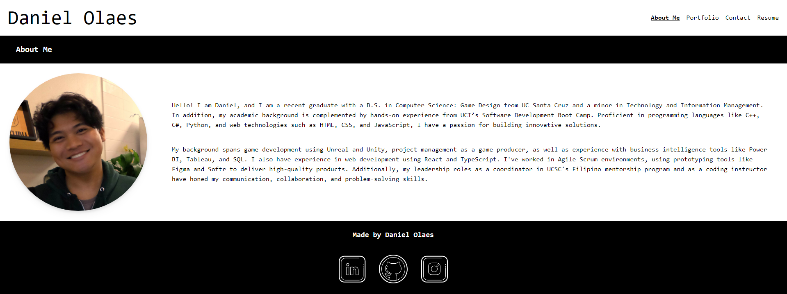

# Portfolio Website

## Description
This project is Daniel Olaes's portfolio website developed using React.js with JavaScript. This single-page application portfolio will allow the user to utilze the navigation bar to render different part of the portfolio, such as an About Me section, Project Portfolio, Contact section, and Resume section. In addition, the footer that appears throughout all of the pages contains icons that lead the user to Daniel Olaes's LinkedIn, GitHub, and a Third-Party social media (Instagram). 

## Table of Contents
- [Installation](#installation)
- [Usage](#usage)
- [Contributing](#contributing)
- [Tests](#test)
- [Questions](#questions)

## Installation
There are multiple way that the user can "install" the portfolio for their use. Firstly, they may download the portfolio source code from GitHub and run it from their computer (https://github.com/dolaes/Portfolio-Website). After installing the portfolio, the user must run "npm i" to download the necessary packages, then the user can run "npm run dev" to deploy the portfolio locally, Second, the user can simply visit the public deployment link (https://danielolaes-portfolio.netlify.app/).

## Usage
Within the portfolio webpage, the user is free to use the navigation bar to view the different sections of the portfolio. The About Me section contains a bio about the developer as well as a profile picture. The Project Portfolio section contain multiple project cards, showcasing the different projects the developer has done. The user can click on the buttons on each card to visit the GitHub or deployment links for each project. The contact section allows the user to leave messages for the developer in case they wish to say something. The resume section contains a list of the developer's proficiencies and a downloadable pdf link for the developer's resume. Lastly, the footer includes icons that lead to the user's profiles on multiple other webpages.

## Contributing
Developed by Daniel Olaes

## Tests
In order to test the portfolio, all the naviagation, download, and project links lead to the correct locations and all the information present on the portfolio is grammatically correct and accurate.

## Questions
For questions, reach out at:
- GitHub: [dolaes](https://github.com/dolaes)
- Email: [danielolaes18@gmail.com](mailto:danielolaes18@gmail.com)